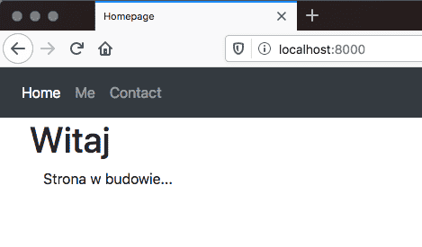
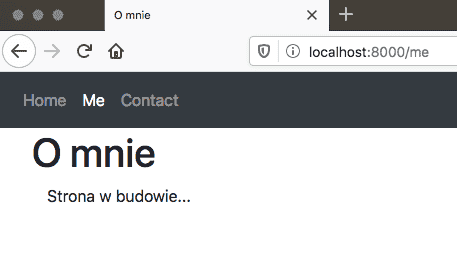

### Autorem zadania jest kodilla.com

## Twoje główne zadania to:

- Stworzenie nowego projektu o nazwie portfolio.
- Stworzenie w nim aplikacji o nazwie infos. Powinna ona umożliwiać wyświetlanie trzech stron dostępnych pod adresami:
    1. localhost:8000/ – strona główna. Parę informacji o tym, co będzie w środku oraz linki do poniższych stron.
    2. localhost:8000/me – krótkie bio, może być zmyślone. Plus za wstawienie zdjęcia. Link do strony głównej.
    3. localhost:8000/contact – jakieś dane kontaktowe. Plus za formularz, w którym można wpisać treść i wysłać przyciskiem. Dane nie muszą się nigdzie zapisywać. Formularz może wysyłać je metodą GET — jest to domyślna metoda dla formularzy, nie musisz więc w nim jej określać. Strona powinna też posiadać link do strony głównej.

Linki na stronach mogą być umieszczone np. w jakimś pasku nawigacji, menu. Zmiana strony powinna powodować zmianę opisu na belce (tag < title > w < head >).

Jeśli użyjesz menu, niech na każdej ze stron będzie jakoś wyróżnione, gdzie jesteśmy. Chodzi o taki efekt jak poniżej:\

Po zmianie strony na localhost:8000/me podświetlone jest Me.\

Postaraj się, by wszystkie strony korzystały poprzez tag extends z jakiegoś głównego szablonu. Plus za dodanie w nim sekcji header i footer. Jeśli umiesz w HTML-a, to śmiało rozwiń tu wodze swojej fantazji.

Nie zapomnij o podstawowym celu ćwiczenia: użycie szablonów, routingu i widoków.

